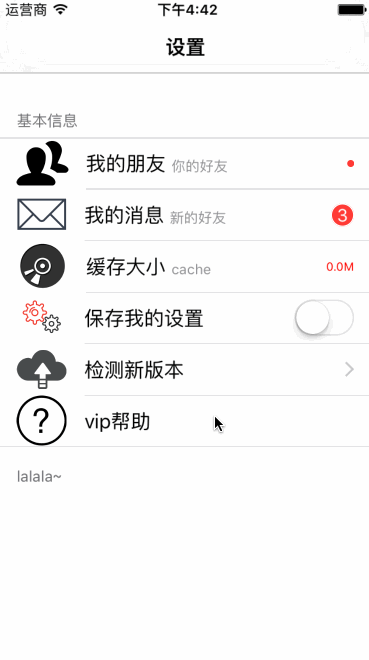

# XFSettings
Custom UITableView for settings,the goal is build setting interface more fast,more convenient.



##Usage
First, add `#import "XFSettings.h` to your UIViewController,the `XFBaseSettingTableViewController` is subclass of UIKit `UITableViewCotroller`,you must extends this clas add set `self.dataSource` reference to your `ViewController`,add `- (NSArray *)baseSettingItems;` method and return `NSArray` datas for background render.

```objc
//.h
#import "XFSettings.h"
@interface ViewController : XFBaseSettingTableViewController
@end

//.m
@interface ViewController ()<XFBaseSettingDataSource>
@end
@implementation ViewController

- (void)viewDidLoad {
    [super viewDidLoad]; // must invoke super method.
    
    self.navigationItem.title = @"设置";
    self.view.backgroundColor = [UIColor whiteColor];
    
    self.dataSource = self; // set self as dataSource.
    
    // set cell color
    XFCellColorData *cellColorData = [[XFCellColorData alloc] init];
    cellColorData.cellBackgroundColor = [UIColor whiteColor];
    cellColorData.cellSelectedBackgroundColor = [UIColor colorWithWhite:0 alpha:0.1];
    self.cellColorData = cellColorData;
}

- (NSArray *)settingItems
{
    return @[ // groupArr
             @{ // groupModel
                 XFSettingGroupHeader: @"基本信息",
                 XFSettingGroupItems : @[ // items
                         @{ // itemModel
                             XFSettingItemTitle: @"我的朋友",
                             XFSettingItemIcon : @"1435582804_group",
                             XFSettingItemClass : [XFSettingInfoItem class], // 这个字段用于判断是否有右边辅助功能的cell,不写则没有
                             XFSettingItemAttrDetailText : @"你的好友",
                             XFSettingItemRelatedCellClass:[XFSettingInfoDotCell class],// 自定义的cell
                             XFSettingItemDestViewControllerClass : [XFNewFriendViewController class], // 如果有目标控制器
                             XFSettingOptionActionBlock : ^(XFSettingInfoCountCell *cell,XFSettingPhaseType phaseType,id intentData){ // 如果有可选的操作
                                 if (phaseType == XFSettingPhaseTypeCellInteracted) {
                                     cell.rightInfoLabel.hidden = YES;
                                 }
                             }
                             },// end itemModel
                         @{
                             XFSettingItemTitle: @"我的消息",
                             XFSettingItemIcon : @"1435527299_message",
                             XFSettingItemClass : [XFSettingInfoItem class],                              XFSettingItemAttrDetailText : @"新的好友",
                             XFSettingItemAttrRightInfo : @"3",
                             XFSettingItemRelatedCellClass:[XFSettingInfoCountCell class],
                             XFSettingOptionActionBlock : ^(XFSettingInfoCountCell *cell,XFSettingPhaseType phaseType,id intentData){
                                 // 交互时处理
                                 if (phaseType == XFSettingPhaseTypeCellInteracted) {
                                     int count = cell.rightInfoLabel.text.intValue;
                                     cell.rightInfoLabel.text = [NSString stringWithFormat:@"%d",++count];
                                 }
                             }
                             },
                         @{
                             XFSettingItemTitle: @"缓存大小",
                             XFSettingItemIcon : @"1435529531_CD-DVD Drive-2",
                             XFSettingItemClass : [XFSettingInfoItem class],
                             XFSettingItemAttrDetailText : @"cache",
                             XFSettingItemAttrRightInfo : @"正在计算",
                             XFSettingItemRelatedCellClass:[XFSettingInfoCell class],
                             XFSettingOptionActionBlock : ^(XFSettingInfoCell *cell,XFSettingPhaseType phaseType,id intentData){
                                
                                 [self cacheDirClear:cell phaseType:phaseType];
                             }
                             },
                         @{
                             XFSettingItemTitle: @"保存我的设置",
                             XFSettingItemIcon : @"1435527366_1-8",
                             XFSettingItemClass : [XFSettingSwitchItem class],
                             XFSettingOptionActionBlock : ^(XFSettingCell *cell,XFSettingPhaseType phaseType,id intentData){
                                 
                                 if (phaseType == XFSettingPhaseTypeCellInteracted) {
                                     if ([intentData[XFSettingIntentDataSwitchOn] boolValue]) {
                                         NSLog(@"%@", @"保存");
                                     }else{
                                         NSLog(@"%@", @"取消保存");
                                     }
                                 }
                             }
                             },
                         @{
                             XFSettingItemTitle: @"检测新版本",
                             XFSettingItemIcon : @"1435529156_cloud-arrow-up",
                             // 使用自定义向右箭头
                             XFSettingItemArrowIcon : @"CellArrow",
                             XFSettingItemClass : [XFSettingInfoItem class],
                             XFSettingItemRelatedCellClass:[XFSettingInfoCell class],
                             XFSettingItemAttrRightInfo : @"有新版本！",
                             XFSettingItemDestViewControllerClass : [UpdateViewController class],
                             XFSettingOptionActionBlock : ^(XFSettingInfoCell *cell,XFSettingPhaseType phaseType,id intentData){
                                 // 自定义初始化样式
                                 if (phaseType == XFSettingPhaseTypeCellInit) {
                                     cell.rightInfoLabel.textColor = [UIColor orangeColor];
                                 }
                             }
                             },
                         @{
                             XFSettingItemTitle: @"vip帮助",
                             XFSettingItemIcon : @"1435529211_circle_help_question-mark",
                             XFSettingOptionActionBlock : ^(XFSettingCell *cell,XFSettingPhaseType phaseType,id intentData){
                                 
                                 
                             }
                             }
                         ],
                 XFSettingGroupFooter : @"lalala~"
                 }// end groupModel
             ];// endgroupArr
}

@end
```
