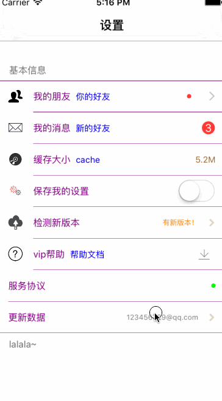

[](http://cocoadocs.org/docsets/XFSettings)


基于UITableView的界面定制，目标是更快更方便地构建设置界面，特点是易维护、可扩展性强。



##安装
1、通过cocoapods
> pod 'XFSettings','2.0.2'

2、手动加入

把XFSettings整个目录拖入到工程

##开发文档
##一、快速开始使用
1.导入主头文件`#import "XFSettings.h`和分类`#import "UIViewController+XFSettings.h"`

2.在`viewDidLoad`方法里设置`XFCellAttrsData`参数

3.设置数据源`self.dataSource`并调用`[self xf_setup]`进行配置

4.最后添加 `- (NSArray *)settingItems`数据源方法返回`NSArray`以供库内部的渲染

```objc
//.m
#import "XFSettings.h"
#import "UIViewController+XFSettings.h"

@interface ViewController ()<XFSettingTableViewDataSource>

@end

@implementation ViewController

- (void)viewDidLoad {
    [super viewDidLoad];
    
    self.navigationItem.title = @"设置";
    self.view.backgroundColor = [UIColor whiteColor];
    
    // set cell attrs
    XFCellAttrsData *cellAttrsData = [[XFCellAttrsData alloc] init];
    // 设置图标大小
    cellAttrsData.contentIconSize = 20;
    // 设置内容间距
    cellAttrsData.contentEachOtherPadding = 15;
    // 标题文字大小（其它文字会按个大小自动调整）
    cellAttrsData.contentTextMaxSize = 13;
    // 表格风格
    cellAttrsData.tableViewStyle = UITableViewStyleGrouped;
    
    self.cellAttrsData = cellAttrsData;
    // 设置数据源
    self.dataSource = self;
    // 调用配置设置
    [self xf_setup];
    
    
}

- (NSArray *)settingItems
{
    __weak UIViewController *weakSelf = self;
    return @[ // groupArr
             @{ // groupModel
                 XFSettingGroupHeader: @"基本信息",
                 XFSettingGroupItems : @[ // items
                         @{ // itemModel
                             XFSettingItemTitle: @"我的朋友",
                             XFSettingItemIcon : @"1435582804_group",
                             // 这个字段用于判断是否有右边辅助功能的cell,不写则没有
                             XFSettingItemClass : [XFSettingInfoItem class], 
                             XFSettingItemAttrDetailText : @"你的好友",
                             // 自定义的cell
                             XFSettingItemRelatedCellClass:[XFSettingInfoDotCell class],
                             // 如果有目标控制器
                            XFSettingItemDestViewControllerClass : [XFNewFriendViewController class], 
                            // 目标控制器带有参数
                             XFSettingItemDestViewControllerUserInfo : @{@"url":@"http://www.yizzuide.com"},
                             // 如果有点击的事件
                             XFSettingOptionActionBlock : ^(XFSettingInfoDotCell *cell,XFSettingPhaseType phaseType,id intentData){
                                // 如果被点击
                                 if (phaseType == XFSettingPhaseTypeCellInteracted) {
                                     cell.rightInfoLabel.hidden = YES;
                                 }
                             }
                             },// end itemModel
                         ],// end items
                 XFSettingGroupFooter : @"lalala~"
                 }// end groupModel
             ];// endgroupArr
}

@end
```
